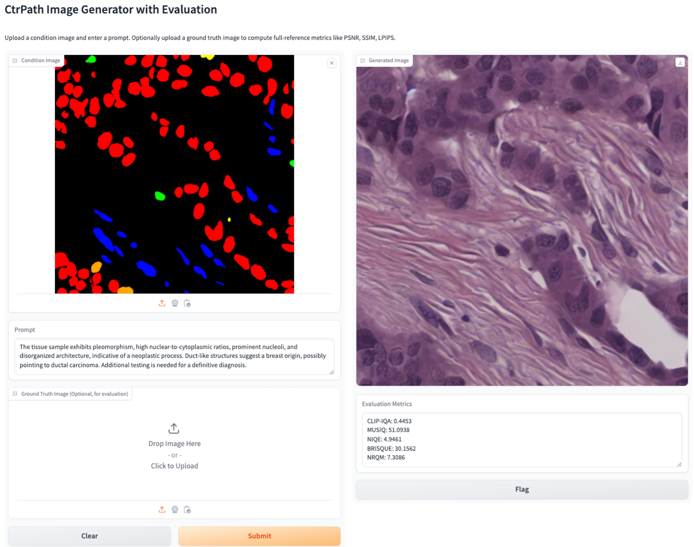

# 🧬 A Controllable Diffusion Framework for Semantic- and Structure-Aware Histopathology Image Synthesis and Super-Resolution

This repository presents an **open-source toolkit** for generating and enhancing histopathology images using diffusion models. The framework consists of two major components:

- 🧠 **CtrPath**: A controllable generation module that synthesizes pathology image patches conditioned on nuclei segmentation masks and clinical-style text prompts.
- 🔍 **SuperDiff** *(to be released)*: A super-resolution module designed to restore high-resolution morphology while preserving staining consistency and structural details.

---

## 1️⃣ CtrPath: Controllable Pathology Image Synthesis

CtrPath builds upon the lightweight conditional diffusion architecture of [CtrlLoRA](https://github.com/xyfJASON/ctrlora), enabling both **structural control** (via nuclei instance maps) and **semantic control** (via natural language prompts). It supports interactive generation and evaluation through a simple Gradio-based GUI.

<p align="center">
  
</p>

*Demo interface: Condition image + prompt (optionally ground truth) → Generated image + Evaluation metrics*

---

## ✨ Key Features

- ✅ Generate realistic $512\times512$ histopathology patches
- 🔬 Condition on **nuclei instance maps**
- 🧠 Incorporate **pathology-style textual prompts**
- 📏 Supports both **no-reference** and **full-reference** image quality evaluation
- ⚡ Lightweight and modular; fast LoRA-based adaptation
- 🎛️ Interactive **Gradio demo** interface

---

## 📦 Installation

CtrPath is built on [CtrlLoRA](https://github.com/xyfJASON/ctrlora). Please install dependencies accordingly:

```bash
# Clone CtrlLoRA and install environment
git clone https://github.com/xyfJASON/ctrlora.git
cd ctrlora
conda env create -f environment.yaml
conda activate ctrlora

# Clone this repository
git clone https://github.com/xuanxu92/ctrPath.git
cd ctrPath
````

---

## 📥 Checkpoint Setup

Download and place the following model checkpoints:

| Component             | Checkpoint Filename                   |
| --------------------- | ------------------------------------- |
| Stable Diffusion v1.5 | `v1-5-pruned.ckpt`                    |
| CtrlLoRA BaseCN       | `ctrlora_sd15_basecn700k.ckpt`        |
| CtrPath LoRA Weights  | `epoch=3-step=199999_saved_lora.ckpt` |

> ☁️ [Download Checkpoints from Google Drive](https://drive.google.com/file/d/1W-_2likkW0nsmnZRieRzx0y_1PTvzM1I/view?usp=sharing)

Update the file paths in `demo_gradio.py` accordingly.

---

## 🚀 Run the Demo

Example condition images, prompts, and ground truths are provided in the `demo/` folder. Launch the Gradio interface with:

```bash
python demo_gradio.py
```

### Inputs

* **🖼️ Condition Image**: Nuclei segmentation mask (PNG)
* **🧠 Prompt**: e.g., `"a high-grade tumor with palisading necrosis"`
* **🧪 Ground Truth Image (Optional)**: Reference image for metric evaluation

### Outputs

* **Generated pathology image**
* **Quantitative metrics** displayed in real time

---

## 📊 Evaluation Metrics

CtrPath supports both reference-based and reference-free evaluations through the [pyiqa](https://github.com/chaofengc/IQA-PyTorch) library.

* **No-reference**: CLIP-IQA, NIQE, BRISQUE, MUSIQ, NRQM
* **Full-reference** (if ground truth is provided): PSNR, SSIM, LPIPS, ST-LPIPS

---

## 🔬 2️⃣ SuperDiff: Pathology Image Super-Resolution (Coming Soon)

SuperDiff is a dual-stage pipeline for enhancing low-resolution histology images. It integrates:

* Stage I: Restoration using SwinIR
* Stage II: Controllable diffusion-based refinement

SuperDiff is currently under internal testing and will be released in a future update.

---


## 🧑‍💻 Acknowledgments

This work builds on the following open-source projects:

- [CtrlLoRA](https://github.com/xyfJASON/ctrlora): Lightweight conditional diffusion framework with LoRA modules.
- [Stable Diffusion](https://github.com/CompVis/stable-diffusion): Foundation model for image generation.
- [ControlNet](https://github.com/lllyasviel/ControlNet): Conditional control mechanisms for Stable Diffusion.
- [PyIQA](https://github.com/chaofengc/IQA-PyTorch): A comprehensive library for image quality assessment (IQA) metrics.
- [PathGen-1.6M](https://github.com/PathFoundation/PathGen-1.6M): A large-scale dataset of histopathology images with paired prompts and nuclei annotations used to fine-tune CtrPath.

We are grateful to the developers and maintainers of these projects for enabling this work.

---

## 🛠️ License

This project is released under the MIT License. See `LICENSE` for details.


